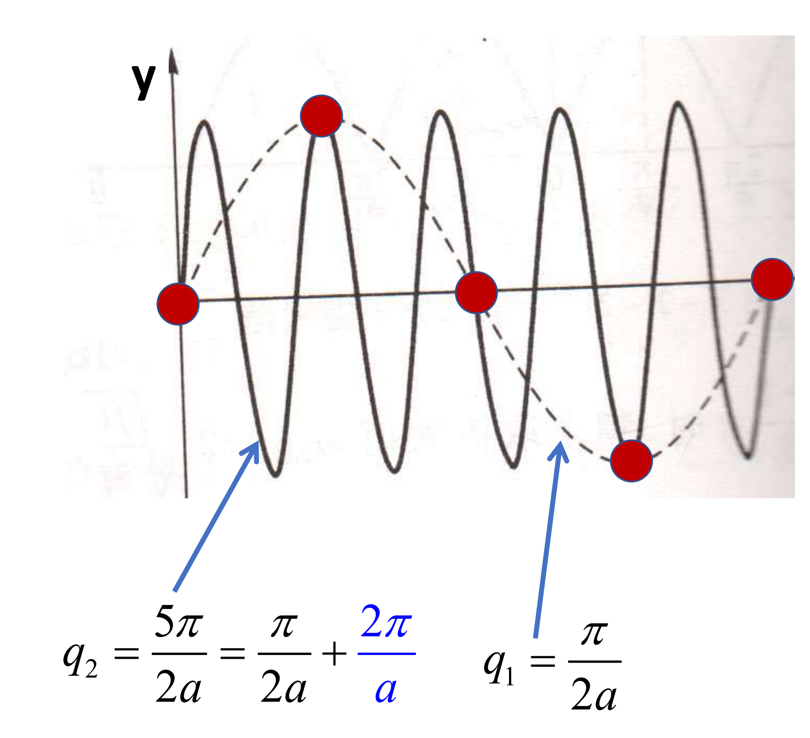
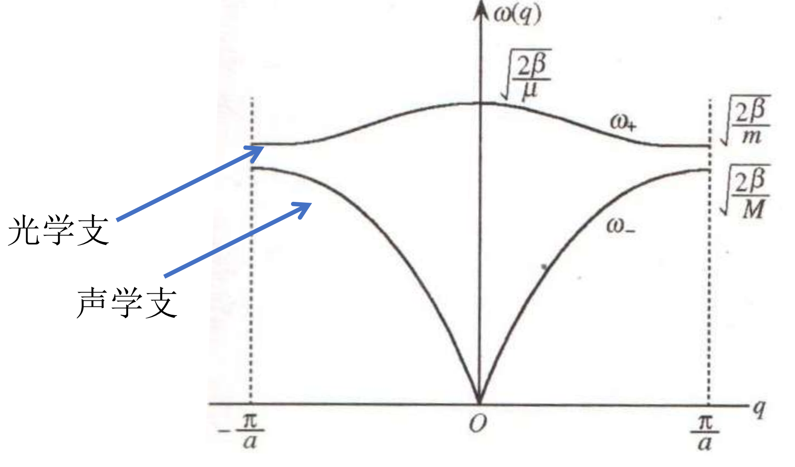

# 晶格振动
实际晶体存在振荡，但晶格周期仍近似存在。晶格振动的频率一般在$10^{12}$Hz左右，远远高于光学频率。晶格振动的频率与晶体的结构有关，因此可以通过晶格振动的频率来研究晶体的结构。
相互作用在平衡位置附近的势能可以泰勒展开：

$$
\begin{align}
V(\vec r)=V_0+\frac{1}{2}\sum_{i,j}\frac{\partial^2V}{\partial r_i\partial r_j}\delta r_i\delta r_j+\cdots
\end{align}
$$

其中$\delta r_i$是离平衡位置的位移。如果只考虑到二阶项，可以得到谐振项。
### 一维单原子晶格振动
最简单情况：一维单原子链的简写振动
* 一个原胞只有一个原子，质量$M$
* 平衡时原子间距为$a$
* 位移为$u_n$的原子的势能为$V(u_n)$
* 只考虑最近邻相互作用
运动方程为：

$$
\begin{align}
M\frac{d^2u_n}{dt^2}=\beta(u_{n+1}-u_n)-\beta(u_n-u_{n-1})
\end{align}
$$

代入谐振格波解：

$$
\begin{align}
u_n=Ae^{i(kna-\omega t)}
\end{align}
$$

得到色散关系：

$$
\begin{align}
\omega(k)=2\sqrt{\frac{\beta}{M}}\left|\sin\left(\frac{1}{2}ka\right)\right|
\end{align}
$$

不同的波矢可以描述相同的振动，其互相之间相差整数个倒格矢$\frac{2\pi}{a}$。由于$\omega(k+G)=\omega(G)$且$\exp(iGR)=1$，所以不改变振荡行为。

只有最小波矢才是独立格波。
格波具有一些极限特征：
* $q\to 0$时，$\omega\to \sqrt{\frac{\beta}{M}}aq=vq$，频率正比波矢，为声波。
* $q\to 0,\omega\to 0$时，该振动色散关系叫做声学支，模式叫做声学模。
* $q=\frac{\pi}{a}$时，$\omega$有极大值，群速度为零，相邻原子反向运动，为驻波。
### 格波的量子化
采取周期性边界：

$$
\begin{align}
u_n = u_{n+N}
\end{align}
$$

则有：

$$
\begin{align}
e^{iq Na}=1
\end{align}
$$

这就导出量子化条件：$q = \frac{2\pi}{Na}l,l\in \mathbb Z$。在一维体系中，相邻$q$点的距离为$\frac{2\pi}{Na}$。则在第一布里渊区中最多有$N$个$q$点，亦即空间内原胞的个数。在第一布里渊区中，只有$N$个独立的格波。在第一布里渊区外，格波相当于被不断反射，因此都非独立。
同时，类似在玻尔兹曼统计中所作的一样，我们可以计算出格波的相空间体积（面积）：$\Delta V = \left(\frac{2\pi}{L}\right)^2$。在采取周期边界条件的情况下，每一个$q$点的密度为$\left(\frac{L}{2\pi}\right)^d$，其中$d$为维数。
### 一维双原子晶格振动
假设相邻原子距离为$\frac{a}{2}$，质量为$m$和$M$。则运动方程为：

$$
\begin{align}
\left.\left\{\begin{aligned}M\frac{d^2u_{n,1}}{dt^2}&=\beta(u_{n,2}+u_{n-1,2}-2u_{n,1})\\m\frac{d^2u_{n,2}}{dt^2}&=\beta(u_{n+1,1}+u_{n,1}-2u_{n,2})\end{aligned}\right.\right.
\end{align}
$$

猜解：

$$
\begin{align}
u_{n,1}=Ae^{i(qna-\omega t)}\\{u_{n,2}=Be^{i(qna-\omega t)}}
\end{align}
$$

则有简正方程：

$$
\begin{align}
\left(M\omega^2-2\beta\right)A+\beta\left(1+e^{-iqa}\right)B=0\\
\beta\left(1+e^{+iqa}\right)A+\left(m\omega^2-2\beta\right)B=0
\end{align}
$$

通过使行列式为零得到色散关系：

$$
\begin{align}
{\omega_\pm}^2=\beta\frac{m+M}{mM}{1\pm[1-\frac{4mM}{(m+M)^2}{\sin^2(\frac12qa)}]^{1/2}}
\end{align}
$$

相比于单原子链，双原子链在每一个格波矢上有两个振动模式。其中，$\omega_-$被称为声学支，而$\omega_+$被称为光学支。这是根据两种模式对光声不同的耦合强度而定义的。在布里渊区中心附近，假如邻近原子带异种电荷，则形成偶极振动。光学支对应的偶极振动能与可见光发生很好的耦合。而声学支对应的模式则是邻近两原子运动模式完全相同，仿佛绑定然后整体形成了一个纵波，即类似声波。

在布里渊区边界上，声学支和光学支分别对应重原子静止或者轻原子静止两种振动模式。
对于声学支：

$$
\begin{align}
q\to 0\Rightarrow \begin{aligned}\omega_-&\approx a(\frac{\beta/2}{m+M})^{1/2}\big|q\big|,\frac{A}{B}\approx1\end{aligned}
\end{align}
$$

对于光学支：

$$
\begin{align}
\begin{aligned}\omega_+&\approx\sqrt{\frac{2\beta}\mu},~{\frac AB}\approx-\frac mM({\mu=\frac{mM}{m+M}})\end{aligned}
\end{align}
$$

光学支描述的振动运动质心不动，相位相反，相当于一个电偶极子，因此与光耦合强。
不加证明的说明：振动模式总数目=原胞内原子数目$\times$波矢数目$\times$振动自由度。
### 三维晶格的振动
基元含有$p$个原子，总原胞数为$N$，振动方向自由度为$3$。则总格波数目为$3p$条，总振动模式有$3pN$个。
* 若$p=1$，则只有3个声学支。
* 其中一条纵波声学支，两条横波声学支。
* 若$p>1$，则还有光学支。比如$p=2$时，有3条声学支代表质心运动，3条光学支代表相对运动。
### 格波的一般能量量子化
仍然对于一维简谐振子链，其哈密顿量为：

$$
\begin{align}
H=\sum_n\frac{p_n^2}{2m}+\frac{1}{2}m\omega^2(x_{n+1}-x_n)^2
\end{align}
$$

首先要做的是把动量和坐标都变换到倒空间中：

$$
\begin{align}
{\mathrm{x}_n}&{=}\frac1{\sqrt{N}}\sum_qe^{iqna}x_q\\{\mathrm{p}_n}&{=}\frac1{\sqrt{N}}\sum_qe^{-iqna}p_q
\end{align}
$$

动量傅里叶变换额外的负号是为了维持正则对易关系。对哈密顿量进行傅里叶变化：

$$
\begin{align}
\begin{aligned}
\sum_n\mathbf{p}_n^2& =\frac1N\sum_n\sum_qp_qe^{-iqna}\sum_{q'}p_{q'}e^{-iq'na}  \\
&=\frac1N\sum_n\sum_q\sum_{q^{\prime}}p_qp_{q^{\prime}}e^{-i(q+q^{\prime})na} \\
&=\frac1N\sum_q\sum_{q'}\sum_np_qp_qe^{-i(q+q')na}
\end{aligned}
\end{align}
$$

利用周期性边界格波矢量子化条件$q=\frac{2\pi}{Na}l$，则有：

$$
\begin{align}
\begin{aligned}\sum_ne^{-i(q+q')na}&=\sum_ne^{-i2\pi(l+l')n/N}\\
&=\frac{1-e^{-i(l+l')2\pi}}{1-e^{-i\frac{l+l'}{N}2\pi}}\\
&=N\delta_{l+l',0}\\&=N\delta_{l,-l'}=N\delta_{q,-q'}\end{aligned}
\end{align}
$$

第三个等号是注意到$l,l'$必须在第一布里渊区里，因此分子除了$l=-l'$否则不为0，而分子总是为0.因此整体如果希望有非零解，必须有$l=-l'$。最终得到动能部分的傅里叶变换：

$$
\begin{align}
\sum_n\mathbf{p}_n^2=\sum_qp_qp_{-q}
\end{align}
$$

仿照之前的动能部分傅里叶，势能部分傅里叶为：

$$
\begin{align}
\begin{aligned}
\sum_s(x_{n+1}-x_n)^2& =N^{-1}\sum_s\sum_q\sum_{q'}x_qx_{q'}\exp(iqsa)[\exp(iqa)-1]  \\
&\times\exp(iq'sa)[\exp(iq'a)-1]=2\sum_qx_qx_{-q}(1-\cos qa)
\end{aligned}
\end{align}
$$

定义$\omega_q^2=2\omega^2[1-\cos(qa)]=4\omega^2\sin(qa)^2$。最终声子坐标系中的哈密顿量整体化简为：

$$
\begin{align}
\text{H=}\frac1{2m}\sum_qp_qp_{-q}+\frac m2\sum_q\omega_q^2x_qx_{-q}
\end{align}
$$

进一步定义两个算符：

$$
\begin{align}
\tilde{Q}_q=x_q(\frac{m\omega_q}{2\hbar})^{1/2}\quad;\quad\tilde{P}_q=p_q(\frac1{2m\omega_q\hbar})^{1/2}
\end{align}
$$

则化成：

$$
\begin{align}
\text{H=}\hbar\sum_q\omega_q(\tilde{P}_q\tilde{P}_{-q}+\tilde{Q}_q\tilde{Q}_{-q})
\end{align}
$$

类比复标量场量子化，我们可以得到：

$$
\begin{align}
\mathbf{b}_q^\dagger=(\tilde{Q}_{-q}-i\tilde{P}_q)\quad;\quad\mathbf{b}_q=(\tilde{Q}_q+i\tilde{P}_{-q})\\
\text{H=}\sum_q\hbar\omega_q[\mathbf{b}_q^\dagger\mathbf{b}_q+1/2]
\end{align}
$$

这是一种特殊的复标量场，因为满足自共轭（实际上就是一个标量场），因此我们描述了一种玻色子，称为**声子**。对于s振动模式中波矢为q的振动，其对应了能量为$\hbar \omega_{qs}$准动量为$\hbar \vec q$的声子。声子是数目对应于格波的振幅。正如之前所陈述的，声子是一种玻色子，因此声子的统计规律满足玻色-爱因斯坦分布。
### 声子的实验测量
我们可以通过声子与入射粒子的散射来测量声子的能动量，散射过程中满足：

$$
\begin{align}
\begin{aligned}&E_f=E_i\pm\hbar\omega\\&\vec{p}_f=\vec{p}_i\pm\hbar\vec{q}+\hbar\vec{G}\end{aligned}
\end{align}
$$

动量守恒式在数学上可以通过写散射矩阵元理解，形式为：

$$
\begin{align}
\int \mathrm d\vec r e^{-i\frac{\vec p_f}{\hbar}\vec r}e^{i\frac{\vec p_i}{\hbar}\vec r}e^{i\vec q \vec r}n(\vec r)
\end{align}
$$

其中电子密度是来自于固体中最重要的库伦势，其具有固体的平移对称性，可以通过格波矢进行展开：$n(\vec r)\propto C_{\vec G}e^{i\vec G\vec r}$，因此指数部分变化为：

$$
\begin{align}
e^{i\left(\frac{\vec p_i}{\hbar}+\vec q+\vec G-\frac{\vec p_f}{\hbar}\right)\vec r}
\end{align}
$$

积分后就得到动量守恒关系。而在真空中，连续平移对称破坏了格波项。由于一般而言，布里渊区边界中$\frac{\pi}{a}$晶格常数一般是几埃，而入射光一般是千埃量级，所以以可见光入射时测量到的可以认为是$\Gamma$点的声子。