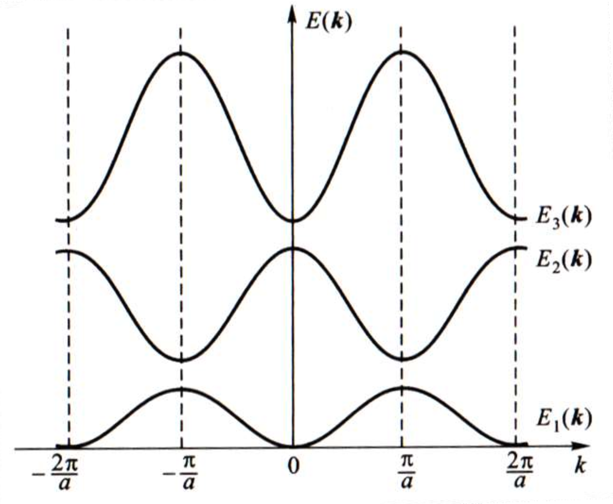
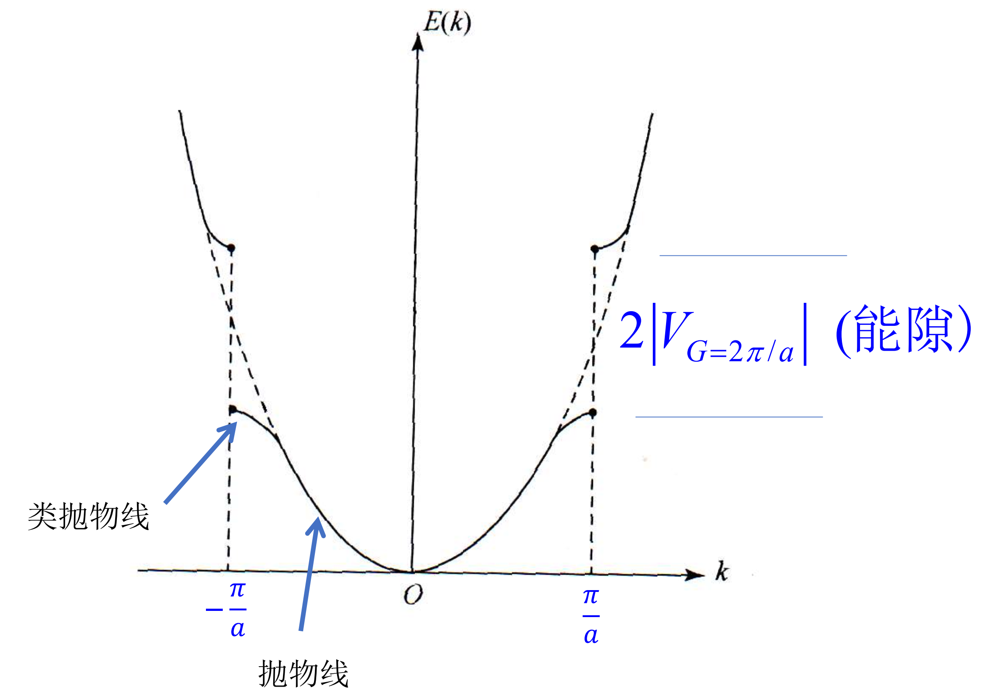
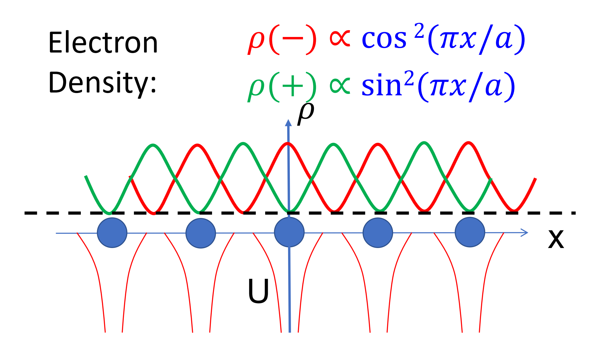
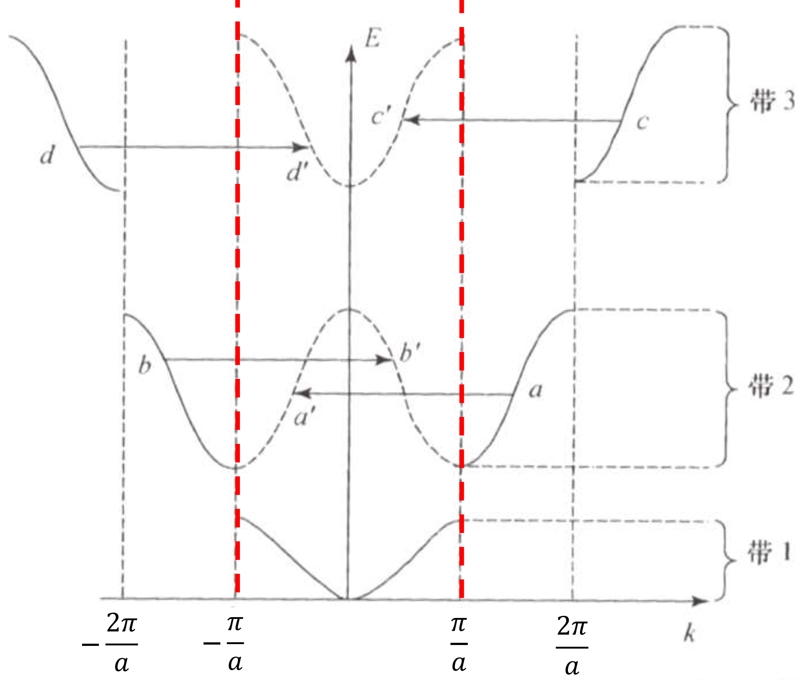
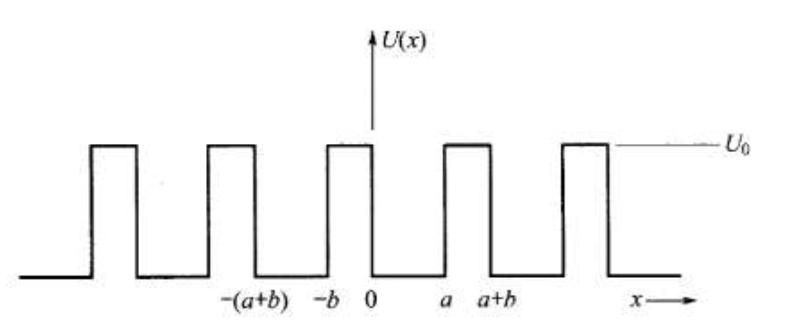
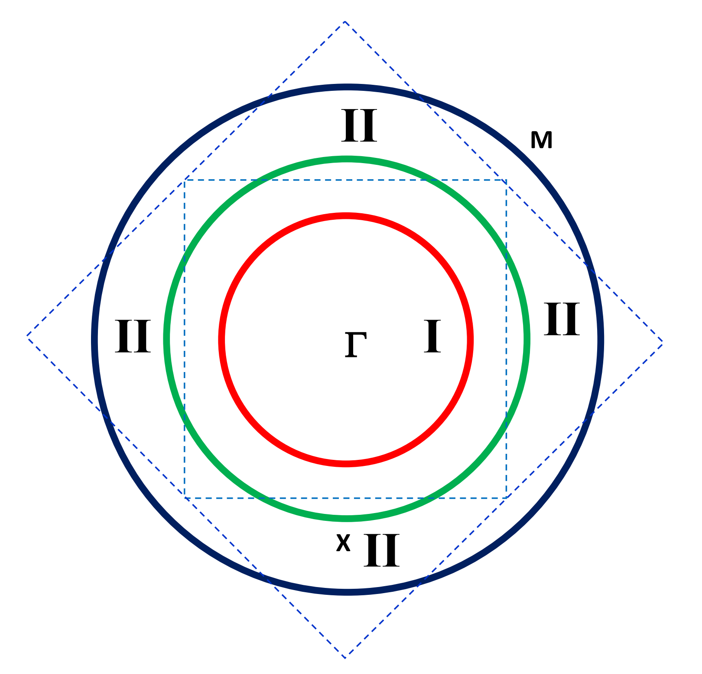
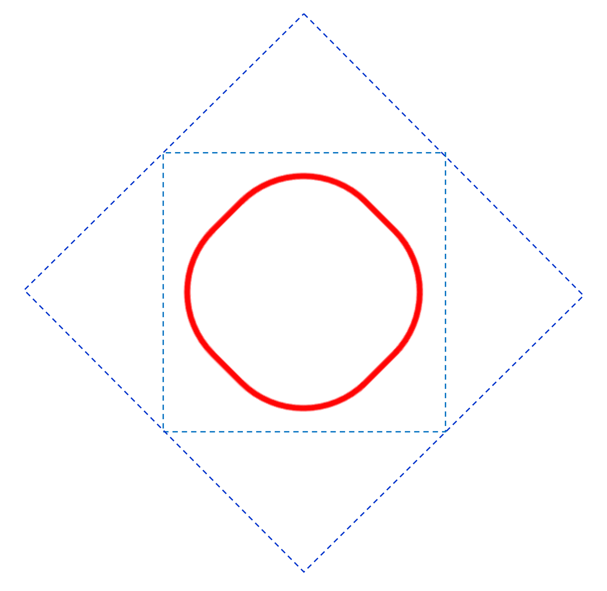
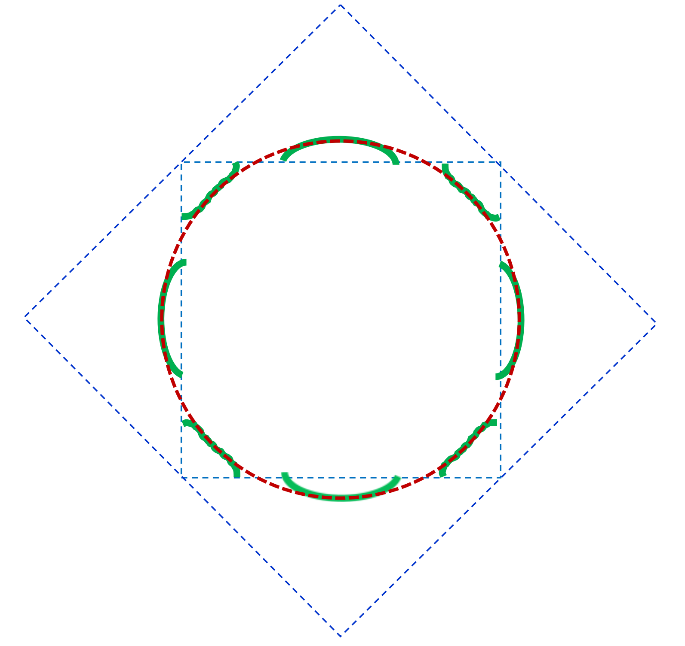
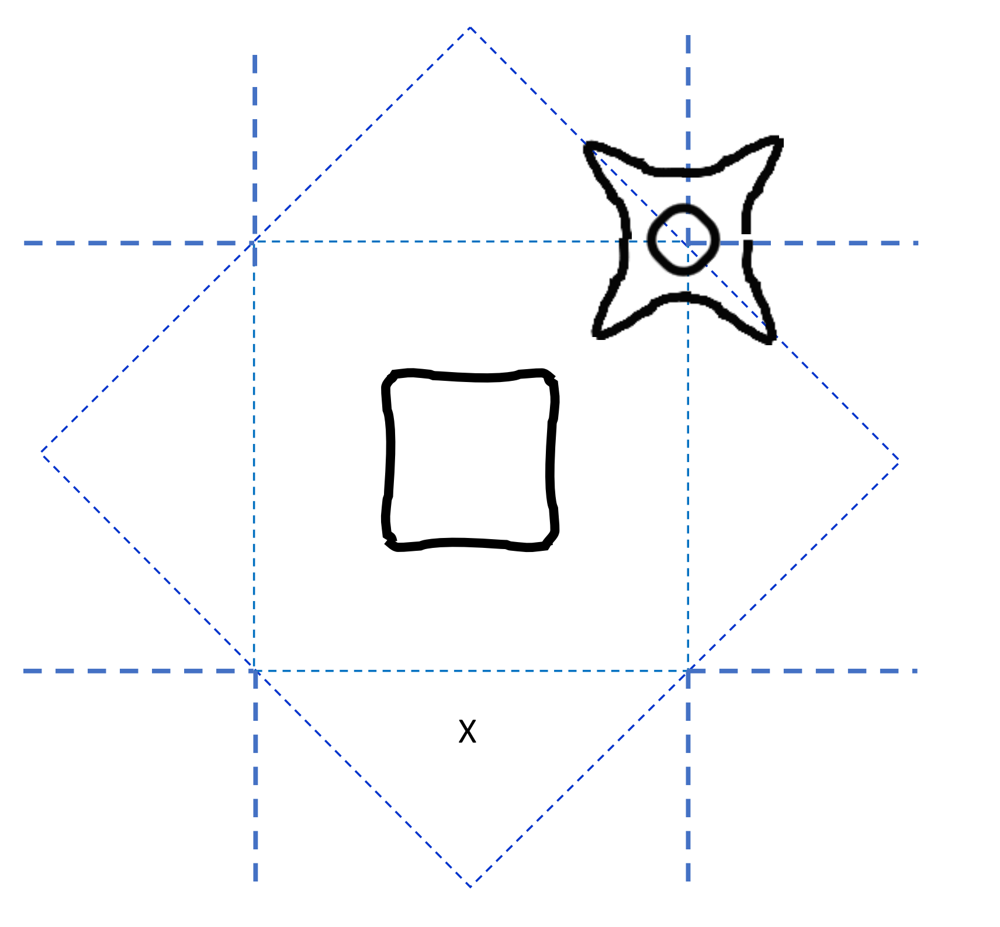
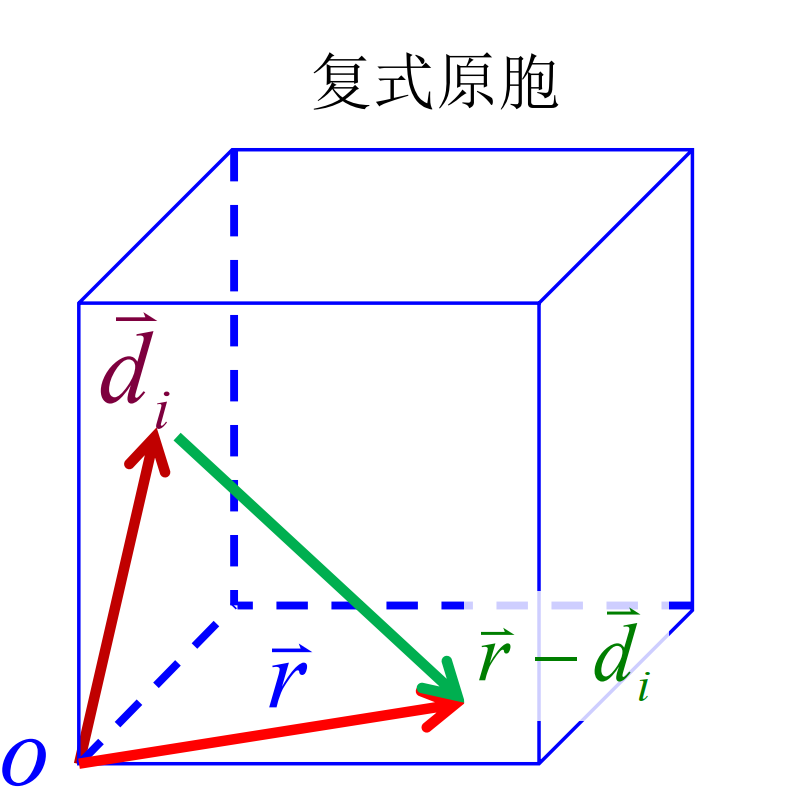

# 能带论
## 能带论基本近似
回到电子的完整哈密顿量：

$$
\begin{align}
H=\sum_i\frac{\vec{p}_i^2}{2m_e}+\sum_n\frac{\vec{p}_n^2}{2M_n}+\frac12\sum_{ij}\frac{e^2}{\left|\vec{r}_i-\vec{r}_j\right|}+\frac12\sum_{nn^{\prime}}\frac{Z_nZ_ne^2}{\left|\vec{R}_n-\vec{R}_{n^{\prime}}\right|}+\sum_{n,i}V_n(\vec{r}_i-\vec{R}_n)+H_{relative}
\end{align}
$$

首先使用波恩奥本海默绝热近似：
* 电子和离子实的哈密顿量解耦
* 描述电子时，离子实被固定在某个位置

则分别得到：

$$
\begin{align}
H_e=\sum_i[\frac{\vec{p}_i^2}{2m}+\sum_nV_n(\vec{r}_i-\vec{R}_n)]+\frac12\sum_{ij}\frac{e^2}{\left|\vec{r}_i-\vec{r}_j\right|}\\
H_c=\sum_n\frac{\vec{p}_n^2}{2M_n}+\frac12\sum_{nn^{\prime}}\frac{Z_nZ_{n^{\prime}}e^2}{\left|\vec{R}_n-\vec{R}_{n^{\prime}}\right|}+{V_{e-c}(\left\{\vec{R}_n\right\})}
\end{align}
$$

根据电子哈密顿量得到的电子能量基态相对应的离子实感受到的电子势场决定${V_{e-c}(\left\{\vec{R}_n\right\})}$。这种近似下，电子的能量贡献了离子实的势能，充当了离子实之间的"共价键"的作用。也因此，这个模型无法考虑电声耦合。
第二个近似：平均场/单电子近似。把电子- 电子库仑相互作用以及电子-离子实之间的库仑相互作用看做一个等效的平均势场，每一个电子都在这样的平均势场中运动。在这样的近似下，电子哈密顿量变化为：

$$
\begin{align}
\begin{aligned}&H_e=\sum_iH(\vec{r}_i,\left\{\vec{R}_n\right\})\\&H(\vec{r},\left\{\vec{R}_n\right\})=\frac{\vec{p}^2}{2m}+V(\vec{r},\left\{\vec{R}_n\right\})\text{平均场}\end{aligned}
\end{align}
$$

第三个近似即为周期性势场近似。即认为晶格的对称性被平均场继承：

$$
\begin{align}
V(\vec r,\left\{\vec R_n\right\})=V(\vec r)=V(\vec r+\vec R_n)
\end{align}
$$

### 布洛赫波
显然哈密顿量继承了晶格的平移对称性。但是哈密顿量的对称性不一定同时是波函数的对称性。实际上，对应于具有离散平移对称的哈密顿量，其本征波函数为Bloch波。

$$
\begin{align}
\varphi(\vec{r})=e^{i\vec{k}\cdot\vec{r}}u_k(\vec{r})\\u_k(\vec{r}+\vec{R})=u_k(\vec{r})
\end{align}
$$

由于周期性边界条件，$\phi(\vec r+N_i\vec a_i)=\phi(\vec r)$。根据Bloch定理，所以$e^{i\vec k\cdot N_i \vec a_i}=1$。这个周期性限制和之前的声子的讨论是一样的，在一维上$k = \frac{2\pi}{Na}l$，三维上：

$$
\begin{align}
\vec k=\frac{l_1}{N_1}\vec b_1+\frac{l_2}{N_2}\vec b_2+\frac{l_3}{N_3}\vec b_3
\end{align}
$$

布洛赫波是哈密顿量的本征态：

$$
\begin{align}
\begin{aligned}&\begin{bmatrix}-\frac{\hbar^2}{2m}\nabla^2+V(\vec{r})\end{bmatrix}e^{i\vec{k}\bullet\vec{r}}u_k(\vec{r})=E(\vec{k})e^{i\vec{k}\bullet\vec{r}}u_k(\vec{r})\\\end{aligned}\\
e^{-i\vec{k}\bullet\vec{r}}[-\frac{\hbar^2}{2m}\nabla^2+V(\vec{r})]e^{i\vec{k}\bullet\vec{r}}u_k(\vec{r})=e^{-i\vec{k}\bullet\vec{r}}E(\vec{k})e^{i\vec{k}\bullet\vec{r}}u_k(\vec{r})\\
\left[\frac{\hbar^2}{2m}\Big(-i\nabla+\vec{k}\Big)^2+V(\vec{r})\right]u_k(\vec{r})=E_ku_k(\vec{r})
\end{align}
$$

$\vec k$与$-i\nabla = \frac{\vec p}{\hbar}$具有同等地位，代表了准动量算符。这样原来对全晶体的本征方程，变为了关于$u_k(\vec r)$的本征方程，只需要在一个原胞里求解。
对于布洛赫波：
* 其能量本征值一定是分立的
* 对于每一个波矢$\vec k$，都对应无穷多个能量$E_n$
* $E_n(\vec k+\vec G)=E_n(\vec k)$
第三点来源于波函数的周期性，这也决定了对于每一个n，其为一个周期函数，因而是有界的，从而形成了**能带**。

这里画成连续，是因为相邻两个$k$的差为$\frac{2\pi}{Na}$很小，被我们视为连续了。
### 弱周期性近似/近自由电子近似模型
在之前，我们描述了自由电子气模型，在这个模型中，晶格势是平坦的。限制我们假设周期性势场非常微弱但不能忽略，需要对之前的平面波解进行一些修正。这种模型对价电子是s或者p轨道的金属是非常适用的。平均场近似下的电子哈密顿量：

$$
\begin{align}
H = H_0+H'
\end{align}
$$

这里$H_0$是自由电子气的哈密顿量，$H'$是晶格势场的影响，平均的周期势场均值已经被假定为能量零点。$H_0=-\frac{\hbar^2}{2m}\nabla^2$对应的本征波函数为平面波，而本正能量/色散关系为$E_0^k=\frac{\hbar^2k^2}{2m}$。我们假设$H'$是一个小量，从而可以对$H'$进行微扰论处理。这里我们只考虑一阶微扰：

$$
\begin{align}
\varphi_k(x)=\varphi_k^0(x)+\sum_{k'(k'\neq k)}\frac{\langle k'\Big|H'\Big|k\rangle}{E_k^0-E_{k'}^0}\varphi_{k'}^0(x)
\end{align}
$$

其中$|k\rangle$为自由电子的本征态，$E_k^0$为自由电子的本征能量。这个微扰近似本质是用其它量子态的波函数的线性组合来表示波函数的扰动，能量相距越近的态贡献越大。

$$
\begin{align}
\langle k'\Big|H'\Big|k\rangle=\langle k'\Big|V(x)\Big|k\rangle=\frac{1}{L}\int \mathrm d x e^{-i(k-k')x}V(x)
\end{align}
$$

由于$V(x)$的周期性，上式只有在$k-k'$为倒格矢时才不为0。因此，我们可以将波函数的修正写成：

$$
\begin{align}
\langle k'\Big|H'\Big|k\rangle=\int \mathrm d x e^{-iGx}V(x)
\end{align}
$$

这正是对势场的傅里叶展开，因此：

$$
\begin{align}
\varphi_k(x)=\varphi_k^0(x)+\sum_{k'(k'\neq k)}\frac{<k'|V(x)|k>}{E_k^0-E_k^0}\varphi_{k'}^0(x)\\=\varphi_k^0(x)+\sum_{k'(k'\neq k)}\frac{V_G}{E_k^0-E_{k'}^0}\varphi_{k'}^0(x)\\
\varphi_k(x)=\frac1{\sqrt{L}}e^{ikx}+\sum_G\frac{V_G}{\frac\hbar{2m}[k^2-(k+G)^2]}\frac1{\sqrt{L}}e^{i(k+G)x}\\
=\frac1{\sqrt{L}}e^{ikx}\left(1+\sum_G\frac{V_G}{\frac\hbar{2m}[k^2-(k+G)^2]}e^{iGx}\right)
\end{align}
$$

可以看出，这个修正波函数是满足bloch定理的。这个修正波函数的能量为：

$$
\begin{align}
E = \langle\psi_k|H|\psi_k\rangle = E_k^0+\langle k|V|k\rangle+\sum_G\frac{\left|V_G\right|^2}{\frac{\hbar^2}{2m}[k^2-\left(k+G\right)^2]}+\dots
\end{align}
$$

第一项修正等价于求势能的均值，已经被设为0.第二项修正在远离布里渊区边界时，分母很大可以忽略。而在布里渊区边界分母过小($(\frac{\pi}{a}-G)^2=\frac{\pi}{a}^2$)，不满足微扰的要求。这时候需要使用简并微扰论，即此时与其波数相同的简并态需要特别考虑。
#### 简并微扰论
在布里渊区边界，波数$k$与$k+G$的能量相同，这时候需要考虑这两个态的混合。这时候我们需要考虑这两个态的线性组合：

$$
\begin{align}
\phi(x) = a\phi_k^0(x)+b\phi_{k'}^0(x)
\end{align}
$$

带入薛定谔方程：

$$
\begin{align}
a[E_k^0-E+V(x)]\varphi_k^0+b[E_k^0-E+V(x)]\varphi_k^0=0\\
\int\varphi_k^{0^*}\Big\{a[E_k^0-E+V(x)]\varphi_k^0+b[E_k^0-E+V(x)]\varphi_k^0\Big\}dx=0\\
\int\varphi_k^{0^*}\Big\{a[E_k^0-E+V(x)]\varphi_k^0+b[E_k^0-E+V(x)]\varphi_k^0\Big\}dx=0
\end{align}
$$

由于$\langle k|V|k\rangle=0$，且假设$\phi_k^0$和$\phi_{k'}^0$正交，且我们已经知道$\langle k'\Big|H'\Big|k\rangle=\int \mathrm d x e^{-iGx}V(x)$，所以化简有：

$$
\begin{align}
\begin{cases}(E_k^0-E)a+V_G^*b=0\\V_Ga+(E_k^0-E)b=0\end{cases}
\end{align}
$$

行列式为0为有解条件，解得：

$$
\begin{align}
E_{k\pm}=\frac{1}{2}{(E_k^0+E_{k'}^0)\pm\sqrt{(E_k^0-E_{k'}^0)^2+4\left|V_G\right|^2}}
\end{align}
$$

在布里渊区边界上，$E_k^0= E_{k'}^0$，这时候上下两能级为：

$$
\begin{align}
E_{k\pm}=E_k^0\pm\left|V_G\right|
\end{align}
$$

而远离布里渊区时，认为动能差远大于势能，做小量近似：

$$
\begin{align}
E_{k\pm}\approx\left\{\begin{aligned}
    E_{k'}^0+\dfrac{\left|V_G\right|^2}{E_{k'}^0-E_k^0}\\\\E_k^0-\dfrac{\left|V_G\right|^2}{E_k^0-E_k^0}
\end{aligned}\right.
\end{align}
$$

退化回非简并微扰论的预言。
在布里渊区边界附近，仍然做小量近似：

$$
\begin{align}
E_{k\pm}\approx\frac{1}{2}\left\{E_k^0+E_{k'}^0\pm\left[2|V_G|+\frac{(E_k^0-E_{k'}^0)}{4|V_G|}^2\right]\right\}
\end{align}
$$

认为$k'\approx k+G$，我们知道$E^0=\frac{\hbar^2k^2}{2m}$，带入计算，最终得到：

$$
\begin{align}
E_{k+}\approx(E_0+\left|V_G\right|)+\frac{\hbar^2}{2m}(k+\frac G2)^2+(\frac{\hbar^2}{2m})^2\frac{G^2}{2\left|V_G\right|}(k+\frac G2)^2\\E_{k-}\approx(E_0-\left|V_G\right|)+\frac{\hbar^2}{2m}(k+\frac G2)^2-(\frac{\hbar^2}{2m})^2\frac{G^2}{2\left|V_G\right|}(k+\frac G2)^2
\end{align}
$$

一般而言，$|V_G|$是小量，所以$E_{k-}\sim -(k+\frac{G}{2})^2$，而$E_{k+}\sim (k+\frac{G}{2})^2$。

从图像上，布里渊区边界产生能隙的原因是因为产生了布拉格反射，因为$k-k'=G$正好满足了布拉格条件。此时，布里渊边界上$E_{k\pm}=E_k^0\pm\left|V_G\right|$分别对应了一个余弦驻波和一个正弦驻波。

由于势场不同，红线对应的势能较低，而绿线对应的势能更高。动能均相同，所以余弦驻波比正弦驻波能量更低。
完整的能带/EDC关系为：

我们知道第一布里渊区有N个k，考虑到自旋，所以每一条能带都有2N个态。则在一维中，对于一价金属，第一条能带不会被填满，构成金属。对于二价晶体，第一条能带被填满，之上有能隙，构成绝缘体。推而广之，奇数价晶体都是导体，而偶数价晶体都是绝缘体。
### Kronig-Penney模型
Kronig-Penney模型是一个一维周期方势阱模型。

在一个周期内解薛定谔方程，设有无势阱区域内的波函数为：

$$
\begin{align}
\begin{aligned}&\varphi(x)=Ae^{ikx}+Be^{-ikx}\\&\varphi(x)=Ce^{ikx}+De^{-ikx}\end{aligned}
\end{align}
$$

带入边界条件，得到：

$$
\begin{align}
A+B=C+D,\quad iK(A-B)=Q(C-D).\\
Ae^{iKa}+Be^{-iKa}=\left(Ce^{-Qb}+De^{Qb}\right)e^{ik(a+b)},\\iK\Big(Ae^{iKa}-Be^{-iKa}\Big)=Q\Big(Ce^{-Qb}-De^{Qb}\Big)e^{ik(a+b)}.
\end{align}
$$

第二个部分使用了bloch条件。最终可以得到限制条件：

$$
\begin{align}
\begin{aligned}&\frac{P}{Ka}\sin Ka+\cos Ka=\cos ka,\\&\epsilon=\frac{\hbar^2K^2}{2m},\quad-1\leq\cos ka\leq1.\end{aligned}
\end{align}
$$

### 无微扰方法
按部就班，首先用正格矢傅里叶展开晶体势场：

$$
\begin{align}
U(x)=\sum_GU_Ge^{iGx}
\end{align}
$$

正如大多数傅里叶变换一样，高频项的系数是非常小的，我们可以在之后做一次截断。
记下来将bloch函数也展开为傅里叶级数：

$$
\begin{align}
\varphi_k(x)=\sum_G\varphi_{k,G}e^{i(k+G)x}=\sum_GC(k-G)e^{i(k-G)x}
\end{align}
$$

直接带入薛定谔方程：

$$
\begin{align}
\sum_k\frac{\hbar^2}{2m}k^2C(k)e^{ikx}+\sum_G\sum_kU_GC(k)e^{i(k+G)x}=\epsilon\sum_kC(k)e^{ikx}.
\end{align}
$$

得到中心方程：

$$
\begin{align}
(\lambda_k-\epsilon)C(k)+\sum_GU_GC(k-G)=0,
\end{align}
$$

其中$\lambda_k=\frac{\hbar^2k^2}{2m}$。这个方程可以看作一个关于$C(k-G)$的矩阵方程，系数行列式为：

$$
\begin{align}
\begin{array}{cccccccc}\ddots&\vdots&\vdots&\vdots&\vdots&\vdots&\ddots\\...&\lambda_{k-2g}-\epsilon&U&0&0&0&...\\...&U&\lambda_{k-g}-\epsilon&U&0&0&...\\...&0&U&\lambda_{k}-\epsilon&U&0&...\\...&0&0&U&\lambda_{k+g}-\epsilon&U&...\\...&0&0&0&U&\lambda_{k+2g}-\epsilon&...\\\ddots&\vdots&\vdots&\vdots&\vdots&\vdots&\ddots\end{array}
\end{align}
$$

这个时候我们就需要做出截断。截断后就可以对这个有限矩阵进行数值求解。
### 空格点近似
空格点近似本质上就是利用第一布里渊区包含了所有独立波矢的性质，通过平移一个正格矢，使得所有的能带能够用第一布里渊区内的波矢表示。这样我们就可以只考虑第一布里渊区内的波矢，从而简化了问题。当然这里我们默认了可以使用自由电子气的近似：

$$
\begin{align}
\epsilon(k_x,k_y,k_z)=\frac{\hbar^2(k+G)^2}{2m}=\frac{\hbar^2}{2m}\left[(k_x+G_x)^2+\left(k_y+G_y\right)^2+(k_z+G_z)^2\right].
\end{align}
$$

当然，在布里渊区边界处不再能如此简单的假设为自由电子气。使用近自由电子气假设，实质就是假设系数$C_G$仍然较小，截断到$2\times2$。

$$
\begin{align}
\begin{vmatrix}\lambda_k-\epsilon&U\\U&\lambda_{k-G}-\epsilon\end{vmatrix}=0.
\end{align}
$$

这个方程的解就是我们之前通过简并微扰得到的EDC。
### 二维的费米面形状
简便起见，我们首先画出自由电子气下的费米面，然后对布里渊区边界附近的能带运用之前得到的修正。如前所述，价电子个数决定了费米面半径大小。一价晶体，价电子个数只能填满第一布里渊区的一半，二价晶体则填满整个第一布里渊区……等等等等。

接下来分别进行修正，可以得到1，2，4价晶体的费米面分别为：

### 几何结构因子和能隙的关系

对于存在几何结构的晶体，其周期性势场是原胞内所有原子的势场的叠加：

$$
\begin{align}
V(\vec{r})=\sum_i\nu_i(\vec{r}-\vec{d}_i)
\end{align}
$$

则傅里叶变换受到影响：

$$
\begin{align}
\nu_i(\vec{r}-\vec{d}_i)=\sum_{\vec{G}_n}\nu_i(\vec{G}_n)e^{i\vec{G}_n\bullet(\vec{r}-\vec{d}_i)}\\
\begin{aligned}&V(\vec{r})=\sum_i\sum_{\vec{G}_n}\nu_i(\vec{G}_n)e^{i\vec{G}_n\bullet(\vec{r}-\vec{d}_i)}\\&=\sum_{\vec{G}_n}\sum_i\nu_i(\vec{G}_n)e^{-i\vec{G}_n\bullet\vec{d}_i}e^{i\vec{G}_n\bullet\vec{r}}\end{aligned}
\end{align}
$$

定义中间项为几何结构因子：

$$
\begin{align}
V(G)=\sum_i\nu_i(\vec{G}_n)e^{-i\vec{G}_n\bullet\vec{d}_i}
\end{align}
$$

$\nu_i(\vec{G}_n)$与原子种类有关，对于同种原子构成的晶体是相同的。后面的相因子提供了一种可能：如之前的衍射消光一样，这使得能隙$2|V_G|$可能不存在。