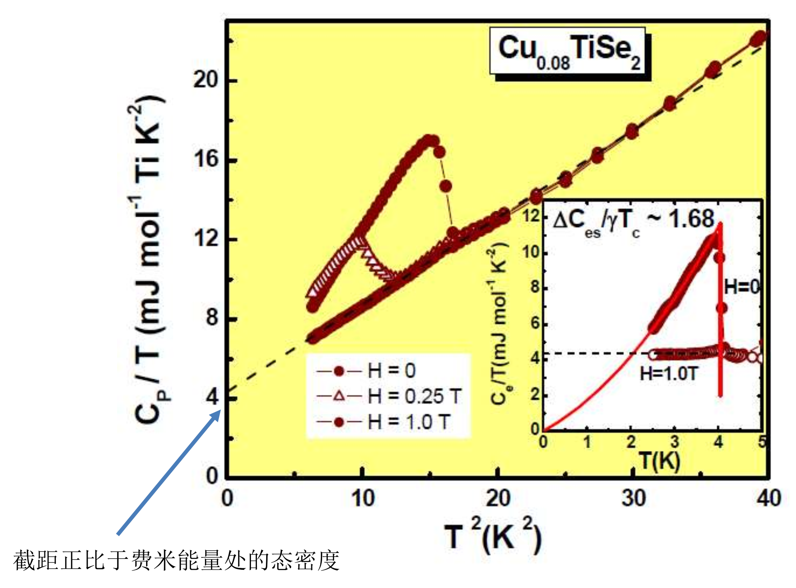

# 金属中的电子
## 唯象理论
首先不考虑晶格的影响，金属中的电子可以看作是自由电子气体，如果用经典的统计方法处理，则称为Drude模型，用量子力学处理则称为Sommerfeld模型。
### Drude模型
假设为：
* 电子是电荷的载体，电流就是电子的运动。
* 电子在金属中自由运动，与其他电子和离子之间没有相互作用。即自由电子气假设。
* 电子是完全经典的粒子。
* 电子不感受晶格势场。
* 离子实保持不动，可以与电子发生散射。
由于经典粒子假设：

$$
\begin{align}
\frac{1}{2}mv^2 = \frac{3}{2}k_BT
\end{align}
$$

室温下，$v \approx 10^5\mathrm{m/s}$，电子自由程取原子间距约$1$nm。则弛豫时间约为$10^{-14}$s。
在外场作用下：

$$
\begin{align}
-e\vec E = m\frac{\mathrm d\vec v}{\mathrm d t}\\
\vec v(t) = \vec v(0) - \frac{e\vec E}{m}t
\end{align}
$$

假设电子全同且各向同性，则有$\sum \vec v(0)=0$。则平均漂移速度为：

$$
\begin{align}
v_d = \frac{e\vec E}{2m}\tau
\end{align}
$$

系数$2$在一些文献中为$1$，这是因为电子的速度分布不是均匀的，而是服从麦克斯韦分布。但是在这里我们只是做一个定性的估计，所以可以取$1$。由微观欧姆定律：

$$
\begin{align}
\vec J = \sigma \vec E, \vec J = -ne\vec v_d
\end{align}
$$

则有：

$$
\begin{align}
\sigma = \frac{ne^2\tau}{m_e}
\end{align}
$$

另一个重要的概念是迁移率：

$$
\begin{align}
\mu = \frac{e\tau}{m}
\end{align}
$$

为了避免弛豫时间的影响，我们使用霍尔效应来检验Drude模型。霍尔效应可以通过实验观测霍尔系数：

$$
\begin{align}
R_H = \frac{E_y}{J_xB_z} = \frac{1}{-ne}
\end{align}
$$

第二个等式来自于Drude模型。
### Sommerfeld模型
其假设为：
* 电子满足费米-狄拉克分布。
* 电子满足薛定谔方程。
* 电子运动可以用弛豫时间近似。
* 电子是近独立近自由。
索末菲模型采取薛定谔方程的平面波解作为电子的波函数：

$$
\begin{align}
\psi(\vec r,t) = \frac{1}{\sqrt V}e^{i\vec k\cdot \vec r }
\end{align}
$$

采取立方晶格的周期性边界条件，则得到量子化条件：

$$
\begin{align}
k_i = \frac{2\pi n_i}{L}
\end{align}
$$

则索末菲模型中，电子的态密度用三维动量坐标系表示为$\frac{V}{8 \pi^3}$。当然考虑到自旋简并度，这个数值还可以乘$2$。
很显然，相空间中的等能面为一个球面。在零温下，费米分布退化为01分布。因此在费米能量下的能级被全部占满。这被称为费米球。反过来，费米球的表面为费米面。
同时，由于独立近似假设，我们可以知道索末菲模型中电子的能量色散关系为：

$$
\begin{align}
E = \frac{\hbar^2k^2}{2m}
\end{align}
$$

可以通过能量色散关系得到态密度：

$$
\begin{align}
\begin{aligned}
&\begin{aligned}E(n)&=\frac{\hbar^2k^2}{2m}=\frac{\hbar^2}{2m}(3\pi^2n)^{2/3}\end{aligned} \\
&n=\frac1{3\pi^2}(\frac{2mE}{\hbar^2})^{3/2} \\
&{g(E)=\frac1V\frac{dN}{dE}} \\
&{=\frac1{\pi^2\hbar^3}(2m^3E)^{1/2}}
\end{aligned}
\end{align}
$$

在非零温条件下，必须使用费米狄拉克分布进行严格计算，通过一定近似处理可以得到费米能的温度依赖关系：

$$
\begin{align}
{\mu=\varepsilon_F-\frac{\pi^2}6\frac{g^{\prime}(\varepsilon_F)}{g(\varepsilon_F)}(k_BT)^2=\varepsilon_F\left[1-\frac{\pi^2}{12}\left(\frac{k_BT}{\varepsilon_F}\right)^2\right]}
\end{align}
$$

第二个等号在自由电子气条件下取到。
### 电子比热
不考虑各种能隙，电子根据费米狄拉克分布。费米海中的大量电子是填满状态，无法激发。因此一般只认为费米面附近$kT$范围内的电子可以被激发，也只有这一部分电子可以贡献热容。传统地计算一下电子的比热：

$$
\begin{align}
u=\int_0^\infty{\varepsilon g(\varepsilon)}f(\varepsilon)d\varepsilon\quad \text{def }Q(\varepsilon)=\int_0^\varepsilon\varepsilon g(\varepsilon)d\varepsilon \\
=\int_0^\infty f(\varepsilon)\mathrm dQ(\varepsilon)=f(\varepsilon)Q(\varepsilon)|_0^\infty-\int_0^\infty Q(\varepsilon)\mathrm df(\varepsilon)\\
=\int_0^\infty Q(\varepsilon)\mathrm df(\varepsilon)\\
\end{align}
$$

对函数$Q$在$\mu$处泰勒展开：

$$
\begin{align}
Q(\varepsilon)=Q(\mu)+(\varepsilon-\mu)Q'(\mu)+\frac12(\varepsilon-\mu)^2Q''(\mu)+\cdots
\end{align}
$$

则有：

$$
\begin{align}
u=\int_0^\infty Q(\varepsilon)\mathrm df(\varepsilon)\\
=Q(\mu)\int_0^\infty\mathrm df(\varepsilon)+Q'(\mu)\int_0^\infty(\varepsilon-\mu)\mathrm df(\varepsilon)+\frac12Q''(\mu)\int_0^\infty(\varepsilon-\mu)^2\mathrm df(\varepsilon)+\cdots\\
\end{align}
$$

由于费米分布的导数近似是$\delta$函数，因此积分下界可以扩展到$-\infty$。则有：

$$
\begin{align}
u=Q(\mu)+\frac12Q''(\mu)\int_{-\infty}^\infty(\varepsilon-\mu)^2\frac{\mathrm d f}{\mathrm d \varepsilon}\mathrm d\varepsilon
\end{align}
$$

不近似直接计算可以得到：

$$
\begin{align}
u=Q(\mu)+\frac{1}{6}\pi^2Q''(\mu)k_B^2T^2
\end{align}
$$

记零温化学势为$\varepsilon_F$，有限温度下，化学势为$\mu$，认为变化不大，再次泰勒展开：

$$
\begin{align}
Q(\mu)=Q(\varepsilon_F)+Q^{\prime}(\varepsilon_F)(\mu-\varepsilon_F)
\end{align}
$$

带入得到：

$$
\begin{align}
\begin{aligned}&u=\boldsymbol{Q}(\boldsymbol{\varepsilon}_F)+\boldsymbol{Q}^{\prime}(\boldsymbol{\varepsilon}_F)(\boldsymbol{\mu}-\boldsymbol{\varepsilon}_F)\\&+\frac{\pi^2}6\boldsymbol{Q}^{\prime\prime}(\boldsymbol{\varepsilon}_F)(\boldsymbol{k}_B\boldsymbol{T})^2\quad\boldsymbol{Q}(\boldsymbol{\varepsilon})=\int_0^\varepsilon\varepsilon\boldsymbol{g}(\boldsymbol{\varepsilon})\boldsymbol{d}\boldsymbol{\varepsilon}\\&=\int_0^{\varepsilon_F}\varepsilon g(\varepsilon)d\varepsilon+\varepsilon g(\varepsilon_F)(\mu-\varepsilon_F)+\frac{\pi^2}6\frac{\mathrm d}{\mathrm d\varepsilon}(\varepsilon g(\varepsilon))(k_BT)^2\end{aligned}
\end{align}
$$

第一项显然就是温度为0的能量。因此能量变化量即为：

$$
\begin{align}
\Delta u=\varepsilon g(\varepsilon_F)(\mu-\varepsilon_F)+\frac{\pi^2}6\frac{\mathrm d}{\mathrm d\varepsilon}\left(\varepsilon g\left(\varepsilon\right)\right)(k_BT)^2
\end{align}
$$

带入上一节最后的结果，可以得到：

$$
\begin{align}
\Delta u =\frac{\pi^2}6g(\varepsilon_F)(k_BT)^2
\end{align}
$$

这个结果可以理解为就是费米面附近的态数量$g(\varepsilon_F)k_BT$获得了$k_BT$的能量激发，这与我们之前的假设不谋而合，当然前面还有一个系数。由于自由电子气中$N\propto k^3=E^{3/2}$，我们立即知道：

$$
\begin{align}
g(E) = \frac{1}{V}\frac{\mathrm dN}{\mathrm dE}=\frac{3n}{2\varepsilon_F}
\end{align}
$$

则电子气的热容可以计算出：

$$
\begin{align}
C_{ev}=\left(\frac{\partial u}{\partial T}\right)_n=\frac{\pi^2}3k_B^2g(\varepsilon_F)T=\gamma T=\frac32nk_B\cdot\frac{\pi^2}3\frac T{T_F}
\end{align}
$$

物理上，结果就是气体的经典热容乘上一个修正的温度，这个温度的修正就来自于只有费米面附近的电子可以被激发这个事实。从第二个等式上看，自由电子气比热正比于温度，系数正比于费米面附近的态密度。由于晶格的比热在极低温下衰减更快，忽略后。我们测量极低温下金属比热，其就反映了自由电子气的比热，从而可以得到费米面附近的态密度。

### 电子气对电磁场的响应
认为外电磁场的振荡频率（比如可见光）远高于电子弛豫时间倒数，则我们可以认为电子与外电磁场相互作用时，电子相互作用可以忽略，电子近似自由。在这种情况下我们可以写出其运动方程：

$$
\begin{align}
m_e\frac{d^2x(t)}{dt}=-eE(t)=-eEe^{-i\omega t}\\
x(t)=x_0e^{-i\omega t}=\frac{eE}{m_e\omega^2}e^{-i\omega t}
\end{align}
$$

这描述了电子在外电磁场中振幅为$x_0$，频率为$\omega$的振动。我们认为这产生了一个大小为$-ex_0$的电偶极矩，则电极化强度作为单位体积的电偶极矩即为：

$$
\begin{align}
P=-nex_0=-\frac{ne^2}{m_e\omega^2}E
\end{align}
$$

通过D高斯：$E = \varepsilon_r\varepsilon_0 E_0=\varepsilon_0E_0+P$，立即知道相对介电常数为：

$$
\begin{align}
\varepsilon_r=1-\frac{ne^2}{m_e\omega^2\varepsilon_0}=1-\frac{\omega_p^2}{\omega^2}
\end{align}
$$

其中，$\omega_p$为等离子体频率。对于一般的金属和可见光，$\omega_p$在紫外光区域，因此一般出现负的相对介电常数，因而折射率$n=\sqrt{\varepsilon}$几乎只含有虚部，虚部即指数衰减的吸收率，因而电磁场在金属中的传播是指数衰减的。这也解释了金属内部几乎没有电场。但这个理论无法解释金属对不同频率电磁场的响应，无法解释金属不同的色泽。
### 电子气的热导率
仿照上一章最后一节，根据我们得到的电子气热容，立即写出热导：

$$
\begin{align}
\kappa_e=\frac{\pi^2nk_B^2T\tau}{3m}.
\end{align}
$$

对比之前的晶格热导，电子的热导理论比较简单。数值上计算可以知道，对于金属而言，电子气的热导占主导，非金属则不一定。
在最基本的Drude模型中我们知道电导率可以表示为：

$$
\begin{align}
\sigma = \frac{ne^2\tau}{m}
\end{align}
$$

其与热导率均正比于弛豫时间。定义洛伦兹常量：

$$
\begin{align}
L = \frac{\kappa}{\sigma T}=\frac{\pi^2}{3}\left(\frac{k_B}{e}\right)^2
\end{align}
$$

这个常量可以通过实验测得，用以检验自由电子气理论的正确性。