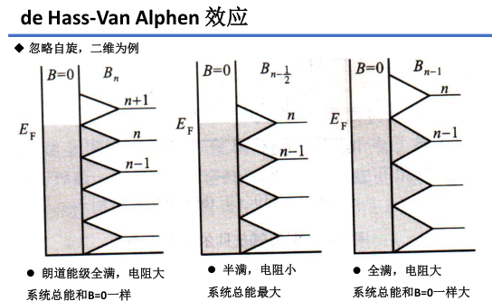
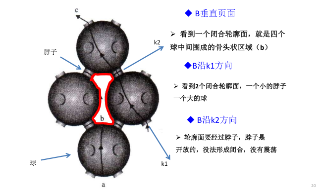
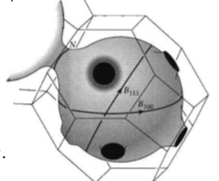
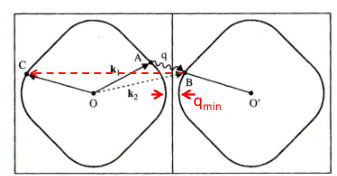

# 布洛赫电子动力学
## 电子在磁场中的运动
电子感受洛伦兹力：

$$
\begin{align}
\hbar\frac{\mathrm d\vec k}{\mathrm{d}t}=-e\vec v\times \vec B
\end{align}
$$

因为电子群速度/波包速度是：

$$
\begin{align}
\vec v = \frac{1}{\hbar}\nabla_k E(\vec k)
\end{align}
$$

可以得到一个经典的结论：洛伦兹力不做功，即电子在磁场中运动不会改变其能量。

$$
\begin{align}
\frac{dE}{dt}=\frac{dE}{d\vec{k}}\cdot\frac{d\vec{k}}{dt}=\nabla_{k}E\left(\vec{k}\right)\cdot\frac{d\vec{k}}{dt}=0.
\end{align}
$$

换一句话说，能带中电子在均匀外磁场下总是沿着**垂直于外磁场的平面和电子等能面的交线运动**。
将速度分解为平行磁场分量和垂直磁场分量，与磁场的平行分量满足$v_{\parallel}\times B=0$，由运动方程，其必为匀速运动。对于垂直磁场的运动，则必然有$\frac{\mathrm d\vec k}{\mathrm d t}\perp\vec v$，且速度分量为动量变化量顺时针旋转90度，亦即实空间的运动相当于动量空间中的运动顺时针旋转90度。由于我们知道均匀磁场中，电子在磁场横截面上做回旋运动，因此电子的倒空间中也是回旋运动。
对于自由电子，其等能面为球面，因此其回旋运动轨迹为一个圆。假设其半径为$K$，则回旋周期为：

$$
\begin{align}
T=\frac{2\pi K}{\frac{1}{\hbar}evB}=\frac{2\pi}{eB}\frac{\hbar K}{v}=2\pi\frac{m}{eB}
\end{align}
$$

这里我们考虑了各向同性的自由电子，因此$K=\frac{m}{\hbar}v$。对于能带中的电子，则需要使用有效回旋质量（不一定等于能带有效质量，有效质量张量的平均值），定义为$m_c^*$。
以上我们使用的经典力学的方法研究的电子在磁场中的运动，这种方法在研究电子在磁场中的运动时是非常有效的。但是在研究电子在磁场中的量子行为时，我们需要使用量子力学的方法。在量子力学中，我们可以通过求解薛定谔方程来研究电子在磁场中的运动。在不考虑自旋磁场相互作用(Zeeman spilt)下，在垂直磁场的平面内电子能量量子化。如果考虑三维情况，我们可以得到：

$$
\begin{align}
E(k)=\frac{\hbar^2}{2m}k_z^2+(n+\frac{1}{2})\hbar\omega_c,\omega_c=\frac{eB}{m_c^*}
\end{align}
$$

在倒空间，自由电子将根据朗道能级进行占据：

在磁场横截面上，朗道能级为一个个朗道环。其简并度是很高的，一种粗糙的推导是假设弱磁场不改变总态密度，每一个朗道能级将相邻两个朗道所围面积中的态数分配给自己，因此朗道能级的简并度为：

$$
\begin{align}
E_n = (n+\frac{1}{2})\hbar\omega_c=\frac{\hbar^2}{2m}(k_x^2+k_y^2)\\
N = \frac{S}{4\pi^2} \Delta A\\
\Delta A = \pi[\Delta(k_x^2+k_y^2)]=\pi\frac{2m}{\hbar^2}\Delta E=\frac{2\pi m}{\hbar^2}\hbar\omega_c=\frac{2\pi eB}{\hbar}\\
\therefore N = \frac{S}{4\pi^2}\frac{2\pi eB}{\hbar}=\frac{eBS}{2\pi\hbar}=\frac{\Phi}{\Phi_0}
\end{align}
$$

考虑了电子自由度之后，朗道能级的简并度为：

$$
\begin{align}
p = 2N = \frac{2e}{h}BS=\frac{\Phi}{\Phi_0}\quad \Phi_0 = \frac{h}{2e}\approx2.067\times10^{-15}\mathrm{Wb}
\end{align}
$$

一般而言，在1T的磁场中，金属的朗道能级数可以达到$10^{4}$量级。因此可以使用半经典的波尔-索末菲近似：

$$
\begin{align}
\oint \vec p\cdot \mathrm d\vec r = 2\pi\hbar(n+\gamma)\quad n\in\mathbb{Z},\gamma\in[0,1)
\end{align}
$$

可以得到实空间中电子的回旋面积为$\frac{2\pi\hbar}{eB}(n+\gamma)$，k空间中的电子回旋面积即为$\left(\frac{eB}{\hbar}\right)^2S_{real}=\frac{2\pi eB}{\hbar}(n+\gamma)$。但是显然我们可以通过能量色散/能级公式看出：

$$
\begin{align}
(n+\frac{1}{2})\hbar\omega_c=\frac{\hbar^2}{2m}k^2\\
S = \pi k^2=\frac{2\pi m}{\hbar^2}(n+\frac{1}{2})\hbar\omega_c
\end{align}
$$

可以得到相同的结论。定义k空间回旋面积为$A_k$，固定回旋面积不变（因为我们知道电子在K空间总是要在等能面/费米面与磁场横截面交线上运动的），所以有：

$$
\begin{align}
\frac{1}{B}=\frac{2\pi e}{\hbar A_k}(n+\gamma)
\end{align}
$$

实验上通过扫描磁场，可以影响电子回旋的朗道能级从而周期性（相对于$\frac{1}{B}$）地改变磁化率、比热等性质。这种现象被称为量子振荡（de Hass-Van Alphen Effect）。

对于三维情况，费米面与磁场的交线有很多条，所有的轨道对于de Hass-Van Alphen效应都会有贡献。类似最小作用量原理中，所有可能路径都可以贡献相位，但是由于高密而迅速抵消，最终极值路径留存。这里总效应最终也是由极值轨道贡献。

由于金银铜都是fcc结构，
> FCC倒格子为BCC，BCC倒格子为FCC。且两者倒格子的晶格常数均为$\frac{2\pi}{a}$，可能与独立原子数有关

计算可以得到，自由电子的费米球直径为$2k_F\approx\frac{9.8}{a}$，通过六角面的格点间距为bcc格子的[111]方向，亦即$\frac{10.88}{a}$，而通过方形面连接的间距为$\frac{12.57}{a}$，因此金银铜只在六角面附近由费米面的连接。

### IQHE

## 电阻
之前讨论的能带中的电子，其波函数是完美的bloch波，其只有绝缘和理想导体的区别。只有考虑了电子-声子作用、电子-电子作用和缺陷等，才存在电阻。
### 电子-声子散射
电子-声子散射作用只发生在费米面附近$k_BT$，因为过于深的电子其距离空态太远。假设声子的能量为$\hbar\omega(q)$，则能动量守恒条件为：

$$
\begin{align}
E_{k'}=E_k\pm\hbar\omega(q),\vec k'=\vec k\pm\vec q+\vec G
\end{align}
$$

相对于电子（费米面附近的）而言，声子的能量较小（meV to eV），但波矢较大，在布里渊区边界附近与费米波矢可以比拟。因此我们可以处理成准弹性散射，电子在散射前后能量不变，动量改变，亦即在费米面上移动。
解电子的玻尔兹曼方程可以给我们一个弛豫时间的表达式：

$$
\begin{align}
\frac{1}{\tau} = \frac{1}{8\pi^3}\int\varpi_{\vec k,\vec k'}(1-\cos\theta)\mathrm d\vec k'
\end{align}
$$

其中$\varpi_{\vec k,\vec k'}$是电子-声子散射概率。基本正比于声子数密度。电阻率使用Drude模型：

$$
\begin{align}
\sigma = \frac{ne^2\tau}{m^*}
\end{align}
$$

#### 高温（大于德拜温度）
高频声子被激发，波矢较大，可以发生大角度散射。由于所有的声子态都可以被相当成都上的激发了，所以认为温度只会影响声子数量而不再显著影响声子的动量。因此上面的解析式中$1-\cos\theta$基本为一个常数。
>回顾声子的态密度：

$$
\begin{align}
D(\omega)\mathrm d\omega=4\pi K^2\frac{V}{8\pi^3}\mathrm dK=\frac{V}{2\pi^2}K^2\frac{\mathrm dK}{\mathrm d\omega}\mathrm d\omega
\end{align}
$$

而在高温，可以使用爱因斯坦模型，声子态密度为一个与温度/能量无关的常量。

高温下，声子数目由玻色统计决定：

$$
\begin{align}
\frac{1}{e^{(\hbar\omega-\mu)/k_BT}-1}\approx\frac{k_BT}{\hbar\omega}\propto T
\end{align}
$$

因此散射概率正比于温度，散射率正比于温度，电阻率正比于温度。

$$
\begin{align}
\frac{1}{\tau}\propto T\Rightarrow\rho\propto T
\end{align}
$$

#### 低温（远小于德拜温度）
* 低温下声子动量很小，散射角很小，$1-\cos\theta=2\sin^2\frac{\theta}{2}=\frac{1}{2}(q/k_F)^2\sim T^2$
* 低温下，假设只有低频声学支，则$\omega=vq$，则声子数目形式上为$\int \varepsilon^2f(\frac{\varepsilon}{k_BT})\mathrm d\varepsilon\propto T^3$。
因此总的而言，$\frac{1}{\tau}\propto T^5$，亦即$\rho\propto T^5$。但这实质上是只考虑了动量守恒中$\vec G=0$的过程，由于低温下这个过程是$T^5$的压低，因此倒逆过程（$\vec G\neq 0$）将会对电阻率有贡献。

倒逆过程相对于正常过程，其波矢具有一个极小值。但一旦发生，电子的运动受到极大散射，因而在低温下对电阻具有可观的贡献。这个贡献就由这个极小值的波矢决定，定义刚好能激发这个最小波矢对应的温度为$\theta$，则$\rho\propto e^{-\frac{\theta}{T}}$。
顺带一提，电子电子相互作用的散射概率正比于$T^2$，因此在低温下，电子电子相互作用的散射会压倒电子声子相互作用的散射。
### 其他电阻贡献
* 剩余电阻率，由于杂质的存在，其不贡献声子，因此和电子是与温度无关的完全弹性散射。
* 磁阻，由于电子在磁场中的运动，其在晶格中的散射会导致电阻。完美的球形费米面和单载流子体系中不存在磁阻，但是如果费米面各向异性，或者有多能带经过费米面，则存在磁阻：

$$
\begin{align}
\frac{\Delta\sigma}{\sigma_0}=\frac{\sigma_{10}\sigma_{20}}{(\sigma_{10}+\sigma_{20})^2}(\omega_{c1}\tau_1-\omega_{c2}\tau_2)^2
\end{align}
$$

此外，还存在负磁阻的效应。
### 相位效应
由于电输运中存在比如杂质的纯弹性散射，这个过程中波矢不变亦即频率不变，但是可以获得一个恒定的相位差，从而使得电子波函数相干。当然，声子等非弹性的散射会破坏相干性，但是低温下，声子散射的弛豫时间远长于杂质散射的弛豫时间，因此定义相干长度为$v_F\tau_{phonon}$。
一个有趣的现象是弱局域化，考虑电子存在一个闭合路径上，正向振幅为$A^+$，反向振幅为$A^-$，则总概率为$|A^+|^2+|A^-|^2+A^+A^{-*}+A^-A^{+*}=4A^2$，相对经典不考虑交叉项，局域化的概率增大了，电阻增大而电导减小。
## 其他输运行为
用量子玻尔兹曼方程来研究电子的非平衡分布函数：

$$
\begin{align}
f_n(\vec r,\vec k,t)
\end{align}
$$

其中$n$是能带指标，且只考虑了一种自旋。由于同时考虑了位置和动量，因此我们实际上使用了一种半经典的方法。以电输运为例：

$$
\begin{align}
\begin{aligned}\vec{J}&=-en(\vec{r},t)\vec{\nu}_d\\&=-\frac2{8\pi^3}\int e\vec{\nu}_{\vec{k}}f(\vec{r},\vec{k},t)d\vec{k}\end{aligned}
\end{align}
$$

其中系数2为自旋自由度，而$\frac{1}{(2\pi)^3}$是基于归一化的考虑。在均匀电场中，布洛赫电子会在倒空间中匀速漂移，分布函数当然也是。进一步考虑了碰撞之后，可以写出连续性方程：

$$
\begin{align}
\begin{aligned}f(\vec{r},\vec{k},t)&=f(\vec{r}-\dot{\vec{r}}dt,\vec{k}-\dot{\vec{k}}dt,t-dt)\\&+(\frac{\partial f}{\partial t})_\text{碰撞}dt\end{aligned}
\end{align}
$$

得到电子稳态玻尔兹曼方程：

$$
\begin{align}
\dot{\vec{k}}\cdot\frac{\partial f}{\partial\vec{k}}+\dot{\vec{r}}\cdot\frac{\partial f}{\partial\vec{r}}=(\frac{\partial f}{\partial t})_\text{碰撞}
\end{align}
$$

做近似处理：
* 近似1：非平衡的稳态分布相对于平衡分布偏离很小！

$$
\begin{align}
f=f_0+f_1,\quad(f_1<<f_0)
\end{align}
$$

* 近似2：碰撞的弛豫时间近似

$$
\begin{align}
(\frac{\partial f}{\partial t})_\text{碰撞}=-\frac{f_0-f}\tau=-\frac{f_1}\tau
\end{align}
$$

最终得到：

$$
\begin{align}
\dot{\vec{k}}\cdot\frac{\partial f_0}{\partial\vec{k}}+\dot{\vec{r}}\cdot\frac{\partial f_0}{\partial\vec{r}}=-\frac{f_1}\tau
\end{align}
$$

对于均匀电场，费米狄拉克分布$f_0$是位置无关的，且$\hbar \dot{\vec k}=-e\vec E$，因此得到：

$$
\begin{align}
-\frac{e\vec{E}}\hbar\cdot\frac{\partial f_0}{\partial\vec{k}}=-\frac{f_1}\tau
\end{align}
$$

由费米狄拉克分布的偶函数性质，电流密度满足：

$$
\begin{align}
\begin{aligned}\bar{J}=-\frac e{4\pi^3}\int f\vec{\nu}_{\vec{k}}d\vec{k}&=-\frac e{4\pi^3}\int(f_0+f_1)\vec{\nu}_{\vec{k}}d\vec{k}\\&=-\frac e{4\pi^3}\int f_1\vec{\nu}_{\vec{k}}d\vec{k}\end{aligned}
\end{align}
$$

带入得到：

$$
\begin{align}
\begin{aligned}
&\vec{J}=-\frac{e^2}{4\pi^3}\int\tau\frac{\partial f_0}{\partial\varepsilon}\vec{\nu}_{\vec{k}}(\vec{\nu}_k\bullet\vec{E})d\vec{k} \\
&=\frac{e^2}{4\pi^3}\int\tau\frac{\vec{\nu}_k(\vec{\nu}_k\bullet\vec{E})}{\hbar\nu_k}(-\frac{\partial f_0}{\partial\varepsilon})dSd\varepsilon 
\end{aligned}
\end{align}
$$

这里第二个等号使用了推导：
>推导为：

$$
\begin{align}
V_{d\omega_s}=\int d\vec{q}=\int_\text{等频率面}dS_{\omega_s}dq_\perp
\end{align}
$$

由于：

$$
\begin{align}
|\nabla \epsilon(\vec q)|\mathrm d q_{\perp}=\mathrm d \epsilon(\vec q)=\mathrm d\omega\\
|\nabla \epsilon(\vec q)|= \hbar |\nabla_k\omega(\vec q)|=\hbar\nu_k
\end{align}
$$

考虑到费米狄拉克函数的形状，近似处理可以得到：

$$
\begin{align}
\vec{J}=\frac{e^2}{4\hbar\pi^3}\int\tau\frac{\vec{\nu}_k(\vec{\nu}_k\bullet\vec{E})}{\nu_k}dS_F
\end{align}
$$

转化成微观欧姆定律形式：

$$
\begin{align}
\vec{J}=[\frac1{4\pi^3}\frac{e^2}\hbar\int\tau\frac{\vec{\nu}_k\vec{\nu}_k}{\nu_k}dS_F]•\vec{E}\quad \sigma_{ij} = \frac1{4\pi^3}\frac{e^2}\hbar\int\tau\frac{\nu_i{\nu}_j}{|\nu_k|}dS_F
\end{align}
$$

考虑各向同性的立方晶系，

$$
\begin{align}
\sigma_{xx}=\frac1{4\pi^3}\frac{e^2}\hbar\int\tau\frac{\nu^2}{\nu_k}dS_F=\frac1{12\pi^3}\frac{e^2}\hbar\int\tau\nu_kdS_F\\
=\frac\tau{12\pi^3}\frac{e^2}{m^*}\int k_FdS_F\\
=\frac{\tau}{3\pi^2}\frac{e^2k_F^3}{m^*}\\
=\frac{ne^2\tau}{m^*}
\end{align}
$$

这里假设了有效质量和球形费米面，可以回到Drude模型。
研究热导和热输运，需要改变玻尔兹曼方程以引入温度和化学势参量：

$$
\begin{align}
\dot{\vec{r}}\cdot\frac{\partial f_0}{\partial\vec{r}}=\dot{\vec{r}}\cdot(\frac{\partial f_0}{\partial T}\nabla T+\frac{\partial f_0}{\partial\mu}\nabla\mu)
\end{align}
$$

利用一些tricks，非常疑惑！！！可以得到：

$$
\begin{align}
-\frac{\partial f_0}{\partial\varepsilon}\vec{\nu}_k\cdot[\frac{\varepsilon_k-\mu}T\nabla T+\nabla\mu]=-\frac{f_1}\tau
\end{align}
$$

带入微观电流表达式可以得到：

$$
\begin{align}
\begin{aligned}\bar{J}&=\frac e{4\pi^3}\int\tau\frac{(\vec{\nu}_k\vec{\nu}_k)\bullet\nabla\mu}{\hbar\nu_k}(-\frac{\partial f_0}{\partial\varepsilon})dSd\varepsilon\\&+\frac e{4\pi^3}\int\tau\frac{(\vec{\nu}_k\vec{\nu}_k)\bullet\nabla T}{\hbar\nu_k}(\frac{\varepsilon-\mu}T)(-\frac{\partial f_0}{\partial\varepsilon})dSd\varepsilon\end{aligned}
\end{align}
$$

这可以用来解释热电效应，结合之前的电场贡献，总的电流密度为：

$$
\begin{align}
\vec{J}=\frac{e^2}{4\pi^3}\int\tau\frac{(\vec{\nu}_k\vec{\nu}_k)\bullet(\vec{E}+\nabla\mu/e)}{\hbar\nu_k}(-\frac{\partial f_0}{\partial\varepsilon})dSd\varepsilon\\+\frac e{4\pi^3}\int\tau\frac{(\vec{\nu}_k\vec{\nu}_k)\bullet\nabla T}{\hbar\nu_k}(\frac{\varepsilon-\mu}T)(-\frac{\partial f_0}{\partial\varepsilon})dSd\varepsilon
\end{align}
$$

化学势梯度和电势梯度是等价的。如果用一个外电场平衡掉“电化学势”