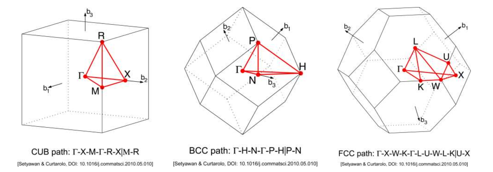

## 晶体结构

### 基本描述

* 电子和原子核
* 库伦作用
  形式上系统哈密顿量为：

$$
\begin{align}
H_T=\sum_{i=1}\frac{\mathbf p_i^2}{2m}+\sum_n\frac{\mathbf P_n^2}{2M_n}+\sum_{i\neq j}\frac{e^2}{|\mathbf r_i-\mathbf r_j|}+\sum_{n\neq m}\frac{Z_mZ_ne^2}{|\mathbf R_n-\mathbf R_m|}+\sum_{i,n}V_n(\mathbf r_i-\mathbf R_n)+H_R
\end{align}
$$

依次为：

* 电子动能
* 原子核动能
* 电子-电子相互作用
* 原子核-原子核相互作用
* 电子-原子核相互作用（由于离子实包含内层电子所以形式复杂）
* 相对论修正（包含自旋轨道耦合、狄拉克项等等）

### 研究方法

* 第一性原理计算
* 元激发模型
  * 核心是探测响应函数
  * 绝大部分情况下弱探测是线性响应函数

### 原子间相互作用

离子键：

* 通过电子转移达到满壳层，由库伦相互作用成键
* 原子之间距离： ~ 两个原子的离子半径相加
  离子键的内聚能Cohesive Energy：定义为离子对的自能：

$$
\begin{align}
E_{\text{cohesive}}=-\frac{e^2}{r_1+r_2}
\end{align}
$$

其中$r_1,r_2$为两个离子的半径。离子键的能量则还需要考虑两中性原子电离所需要的能量。

共价键则是共享电子形成。原子的电子轨道进行线性组合形成分子的电子轨道。在二维情况下，成键态和反键态分别为：

$$
\begin{align}
\begin{aligned}
\psi_1&=\frac{1}{\sqrt{2}}(\psi_A+\psi_B)\\
\psi_2&=\frac{1}{\sqrt{2}}(\psi_A-\psi_B)
\end{aligned}
\end{align}
$$

其中$\psi_A,\psi_B$分别为两个原子的电子轨道。进一步，$sp^3$杂化即为：

$$
\begin{align}
\begin{gathered}
\left|h_{1}\right\rangle  =\frac12\big(|s\rangle+|p_x\rangle+|p_y\rangle+|p_z\rangle\big), \\
|h_{2}\rangle  =\frac12(|s\rangle+|p_x\rangle-|p_y\rangle-|p_z\rangle), \\
\left|h_{3}\right\rangle  =\frac12(|s\rangle-|p_x\rangle+|p_y\rangle-|p_z\rangle), \\
\left|h_{4}\right\rangle  =\frac12(|s\rangle-|p_x\rangle-|p_y\rangle+|p_z\rangle). 
\end{gathered}
\end{align}
$$

### 描述晶体结构

晶体基本的对称性：

* 晶体一定具有平移对称性

对晶体的描述包含：

* 基元(Basis)：晶体中重复的单元
* 晶格(Lattice)：晶体的空间排列形式

晶格的类型是有限的，又叫布拉维格子。在三维空间中只有14种。
定义基矢为不共线的最短向量$\vec a_1,\vec a_2$，取法不唯一。
晶格+基元=晶体，**晶格的对称性高于晶体的对称性**。
原胞：

* 晶格中最小的重复单元
* 原胞可以通过平移填满全空间
* 原胞取法不唯一
* 每一个原胞只包含了一个格点
  原胞的对称性小于等于晶格的对称性。
  二维晶格只有$n=1,2,3,4,6$重对称性。假设研究$n$重对称性，绕转动轴顺时针逆时针分别旋转$\theta=\frac{2\pi}{n}$，新的两个格点之间距离为$2\cos\theta$。由于这个距离平行与原轴，所以有：

$$
\begin{align}
2\cos\frac{2\pi}{n}=m\quad m\in\mathbb N
\end{align}
$$

所以$n=1,2,3,4,6$。
三维空间中，共有**7大晶系14种布拉维格子**。

考虑到基元导致的对称性下降，最后只有**230种空间群**，对应**230种空间的对称操作**。

### 一些实际晶体的结构

在立方晶系种，主要是三种晶体：

* 简单立方sc：最简单的晶体结构，如铀
* 面心立方fcc：最密堆积的晶体结构，如铜
* 体心立方bcc：如铁
  完整的表格如图：
  
  
  对于金刚石结构，可以认为是fcc沿对角线进行平移获得，亦即双基元的fcc：
  
  更复杂一点，钙钛矿结构，为简单正交结构加上CaTiO$_3$的基元。

### 晶向与晶面

* 任意两个格点连线的延长线会经过无穷多格点。
* 连线方向称为晶向
* 晶向用该方向最短的格矢来表示
  由于晶胞具有更高的对称性，因此我们可以用晶胞的基矢来表示晶向（比如用简单正交研究正交晶系，用简单立方研究立方晶系）。如果最短格矢为：

$$
\begin{align}
\vec R = l_1\vec a_1+l_2\vec a_2+l_3\vec a_3
\end{align}
$$

且$l_1,l_2,l_3$互质，则晶向为$[l_1,l_2,l_3]$。

但是注意到，$[110]$和$[1\bar 1 0]$是等价的。约定一组等价的晶向为$<uvw>$。其中$u,v,w$均可以取其相反数。在晶胞种晶向的表示是依赖于基矢的选取的。
考虑到不共线三点可以定义一个晶面，且该晶面也包含无穷格点。一组无穷多且等间距的平行面用一族晶面来表示，晶面用米勒指数标记，用圆括号括出。
仍然以晶胞为讨论对象，以某一个格点为原点，选取晶胞基矢。确定离原点最近的晶面在基矢上的截距为$l_1(\vec a_1),l_2(\vec a_2),l_3(\vec a_3)$，取倒数$\frac{1}{l_1},\frac{1}{l_2},\frac{1}{l_3}$，等比例化为最小整数$h,k,l$，则米勒指数为$(hkl)$。如果晶面平行于某个基矢，则对应的指数为0。

同样的，由于立方晶系的对称性，导致不同米勒指数对应的晶面可以是等价的。用大括号${hkl}$表示一组等价的晶面，比如${hkl}=(110)(\bar 110)(101)(10\bar1)(011)(01\bar1)$。**在立方晶系种，晶面$(hkl)$的法向正好是晶向$[hkl]$。**
六角晶系比较特殊，会用四指数。前三指数之和必定为0。

当然我们也可以用原胞基矢来表示晶面。除了基矢选取之外其他的规则是类似的。

### 倒格矢

倒格矢：实空间中的晶阵可以用如下的狄拉克函数表示：

$$
\begin{align}
f(\vec r)=\sum_{\vec R}\sum_{i}\delta(\vec r-\vec R-\vec b_i)
\end{align}
$$

其中$\vec R$是所有布拉维晶格矢量，$\vec b_i$是元胞内格点的矢量，则做傅里叶变换到相空间：

$$
\begin{align}
\begin{aligned}
F(\vec{k})& =\int_{-\infty}^{\infty}d^{3}rf(\vec{r})e^{i\vec{k}\cdot\vec{r}}  \\
&=\sum_{\vec{R}}e^{i\vec{k}\cdot\vec{R}}\left(\sum_ie^{i\vec{k}\cdot\vec{b}_i}\right).
\end{aligned}
\end{align}
$$

$\left(\sum_ie^{i\vec{k}\cdot\vec{b}_i}\right)$被称为结构因子。由于宏观晶体有几乎无限的$\vec R$，因此除非存在特定的$\vec Q$满足：

$$
\begin{align}
\vec Q\cdot\vec R=2\pi N\quad N\in\mathbb N
\end{align}
$$

否则高速振荡项会相消。可以证明，$\vec Q$必然有如下形式：

$$
\begin{align}
\vec Q=\nu_1\vec q_1+\nu_2\vec q_2+\nu_3\vec q_3,
\end{align}
$$

其中：

$$
\begin{align}
\begin{gathered}
\vec{q}_{1} =\frac{2\pi(\vec{a}_{2}\times\vec{a}_{3})}{\vec{a}_{1}\cdot(\vec{a}_{2}\times\vec{a}_{3})} \\
\vec{q}_{2} =\frac{2\pi(\vec{a}_{3}\times\vec{a}_{1})}{\vec{a}_{1}\cdot(\vec{a}_{2}\times\vec{a}_{3})} \\
\vec{q}_{3} =\frac{2\pi(\vec{a}_{1}\times\vec{a}_{2})}{\vec{a}_{1}\cdot(\vec{a}_{2}\times\vec{a}_{3})}. 
\end{gathered}
\end{align}
$$

这里，$\nu_i$是整数，$a_i$是正格式的基。显然有关系$\vec q_i\cdot\vec a_j=2\pi\delta_{ij}$。在相空间中，$\vec Q$绘制出了与实空间中$\vec R$一一对应的点阵，仅在$\vec Q$的位置傅里叶变换非零。$\vec Q$被称为倒格矢，其所处空间也称为倒空间。
结构因子$\left(\sum_ie^{i\vec{Q}\cdot\vec{b}_i}\right)$有时也会体现$\vec Q$和元胞内部对称性的影响。

如果只考虑格点，还有一种推导方式：

$$
\begin{align}
F(\vec r)=F(\vec r+\vec R)\\
F(\vec G) = \frac{1}{\Omega}\int d^3r e^{i\vec G\cdot\vec r}F(\vec r)\\
=\frac{1}{\Omega}\int d^3r e^{i\vec G\cdot\vec r}F(\vec r+\vec R)\\
=\frac{1}{\Omega}\int d^3r e^{i\vec G\cdot\vec r}e^{i\vec G\cdot\vec R}F(\vec r)\\
=F(\vec G)e^{i\vec G\cdot\vec R}\therefore e^{i\vec G\cdot\vec R}=1
\end{align}
$$

重要公式：倒格矢元胞体积

$$
\begin{align}
\Omega^*=\frac{(2\pi)^3}{\Omega}
\end{align}
$$

**晶格的倒格子**：

| 正格子 | 简单立方 | 体心立方 | 面心立方 | 六角晶格 |
| ------ | -------- | -------- | -------- | -------- |
| 倒格子 | 简单立方 | 面心立方 | 体心立方 | 六角格子 |

在$(h,k,l)$指标中，晶面法向即为$h\vec a_1+k\vec a_2+l\vec a_3$。则倒格矢$\vec G=h\vec b_1+k\vec b_2+l\vec b_3$。可以计算出$\vec G$平行于晶面法向。晶面间距可以通过倒格矢计算：

$$
\begin{align}
d_{hkl}=\frac{\vec G}{|\vec G|}\cdot\frac{\vec a_1}{h_1}=\frac{2\pi}{|\vec G|}=\frac{1}{|\vec G|}\sqrt{h^2\vec b_1^2+k^2\vec b_2^2+l^2\vec b_3^2}
\end{align}
$$

如果晶面在原胞内定义，则$d$为最小面间距，而如果是在晶胞内定义的，则不一定为最小面间距。

## 晶体衍射

布拉格条件：

$$
\begin{align}
2d\sin\theta=n\lambda
\end{align}
$$

由该公式知道有可以衍射的最短波长：$d>\frac{\lambda}{2}$。
满足布拉格公式的光波衍射增强，但布拉格公式不能给出衍射强度分布，不满足布拉格公式的光波衍射也可能得到增强，虽然会较小。
劳厄条件：

散射过程中波矢改变方向不改变模长，则相当于附加一个相因子$e^{i(\vec k-\vec k')\vec r}$。则总散射振幅为

$$
\begin{align}
F\propto \int d^3r e^{i(\vec k-\vec k')\vec r}n(\vec r)\\
=\sum_{\vec G}n(\vec G)\int d^3r e^{i(\vec k-\vec k')\vec r}e^{i\vec G\vec r}\\
\propto \sum_{\vec G}n(\vec G)\delta(\vec k-\vec k'+\vec G)
\end{align}
$$

劳厄条件即是$\vec k-\vec k'=\vec G$。由于一般散射保持波矢大小不变，因此有：

$$
\begin{align}
k = |\vec k -\vec G|\\
k^2 = k^2-2 \vec k\cdot \vec G+G^2\\
\frac 1 2 G^2 = \vec k\cdot \vec G
\end{align}
$$

设定$\vec G_1$是$\vec G$方向上的最短倒格矢，则令$\vec G=n\vec G_1=n\frac{2\pi}{d}$则可以通过劳厄条件回到布拉格条件。这里$n$是整数。
Ewald球：

想看到更多的衍射峰可以：

* 入射光用非单色光
* 入射方向可调，一般采用转动晶体
* 样品是多晶或者粉末（粉末X光衍射）

### 衍射强度和结构的关系：

* 形状因子：格点上原子种类不同
* 结构因子：基元多于一个原子
  对于正格矢为$\vec R$的晶体，假如格点上有一个原子，则在位置$\vec r$处的电子密度为：

$$
\begin{align}
n(\vec r)=\sum_{\vec R}\rho(\vec r-\vec R)
\end{align}
$$

则衍射强度满足：

$$
\begin{align}
F=c\sum_{\vec{R}}\int\rho(\vec{r}-\vec{R})e^{-i\vec{G}\bullet\vec{r}}d\vec{r}\\
\begin{aligned}F&=c\sum_{\vec{R}}e^{-i\vec{G}\bullet\vec{R}}\int\rho(\vec{\eta})e^{-i\vec{G}\bullet\vec{\eta}}d\vec{\eta}\\&=cN\int\rho(\vec{\eta})e^{-i\vec{G}\bullet\vec{\eta}}d\vec{\eta}=cNf(\vec{G})\end{aligned}
\end{align}
$$

其中$f(\vec G)$被称为形状因子。比如，对于"电子晶体",$\rho(\vec r)=\delta(\vec r-\vec R)$，则最终得到$F=cN$，衍射强度得到满足劳厄条件时为正比于$N^2$。对于元胞内有多个原子，假设原子基于正格矢的位矢为$\vec b_i$。之前提到结构因子可以写为：$\left(\sum_ie^{i\vec{k}\cdot\vec{b}_i}\right)$。如果考虑到形状因子，则为：

$$
\begin{align}
S(\vec G)=\sum_if_i(\vec G)e^{-i\vec G\cdot\vec b_i}\quad f_i(\vec G)=\int\rho_i(\vec r)e^{-i\vec G\cdot\vec r}d\vec r
\end{align}
$$

总和的散射强度为：

$$
\begin{align}
I = c^2N^2S(\vec G)^2
\end{align}
$$

结构因子的存在是在使用晶胞而非最小原胞表示时，保存下晶胞内部的几何结构。如果使用原胞，则我们不会遇到结构因子为0的倒格矢，而使用晶胞时，结构因子为0的倒格矢是存在的，但其本身就是因为选取晶胞而产生的。
